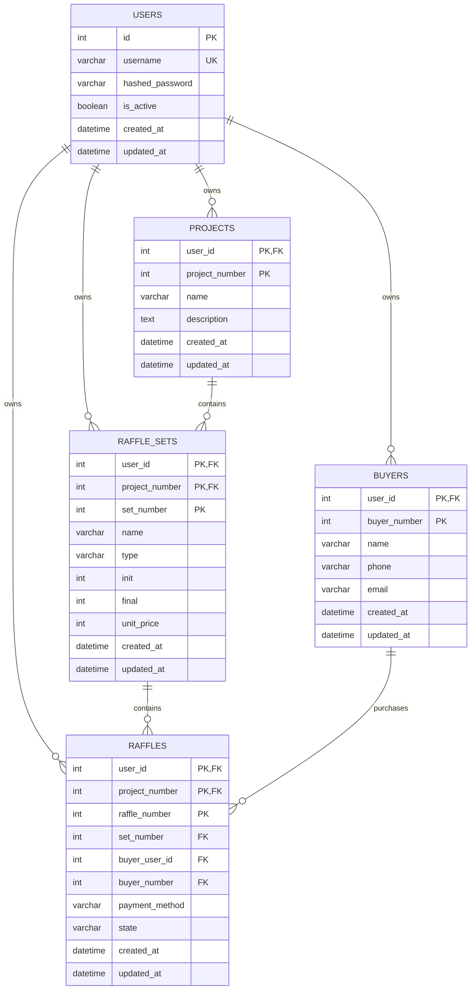
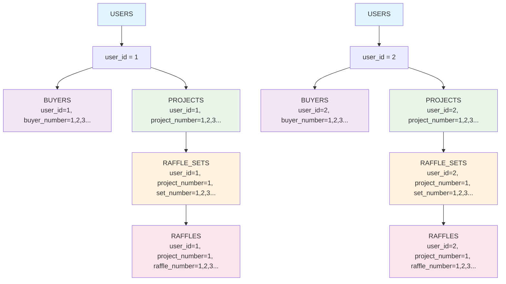
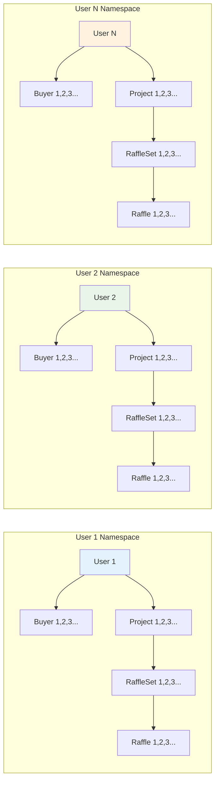
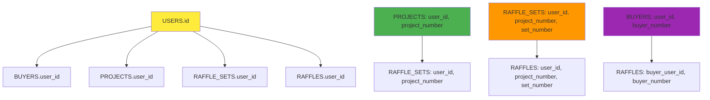
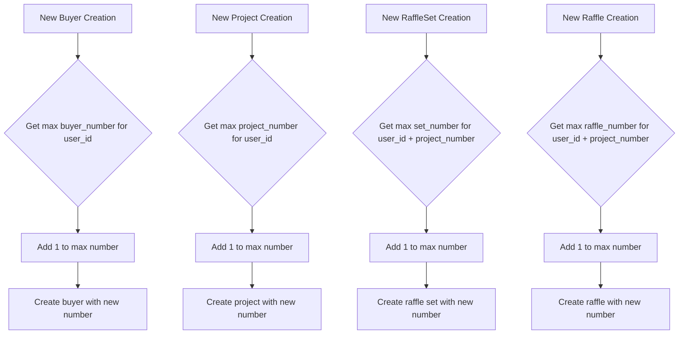

# Database Schema Diagram

## Entity Relationship Diagram

## Composite Primary Key Structure

## User Isolation Visualization

## Foreign Key Constraints

## Auto-increment Scoping

## Benefits Summary

### 🔒 Security Benefits
- **No ID enumeration**: Users can't guess other users' entity IDs
- **Complete isolation**: Zero possibility of cross-user data access
- **Information hiding**: System usage patterns are hidden

### 👤 User Experience Benefits  
- **Intuitive numbering**: Each user's entities start from 1
- **Predictable URLs**: `/buyer/1` always means "my first buyer"
- **Logical hierarchy**: Clear parent-child relationships in URLs

### 🏗️ Technical Benefits
- **Scalability**: Ready for horizontal partitioning by user_id
- **Maintainability**: Universal functions work across all models
- **Performance**: Efficient queries with proper composite indexing
- **Flexibility**: Easy to add new entity types following same pattern

### 📊 Data Integrity Benefits
- **Referential integrity**: Composite foreign keys prevent orphaned records
- **Consistent numbering**: No gaps in user-scoped sequences
- **Audit trails**: Clear ownership and modification tracking
- **Backup/restore**: User-scoped data can be backed up independently

